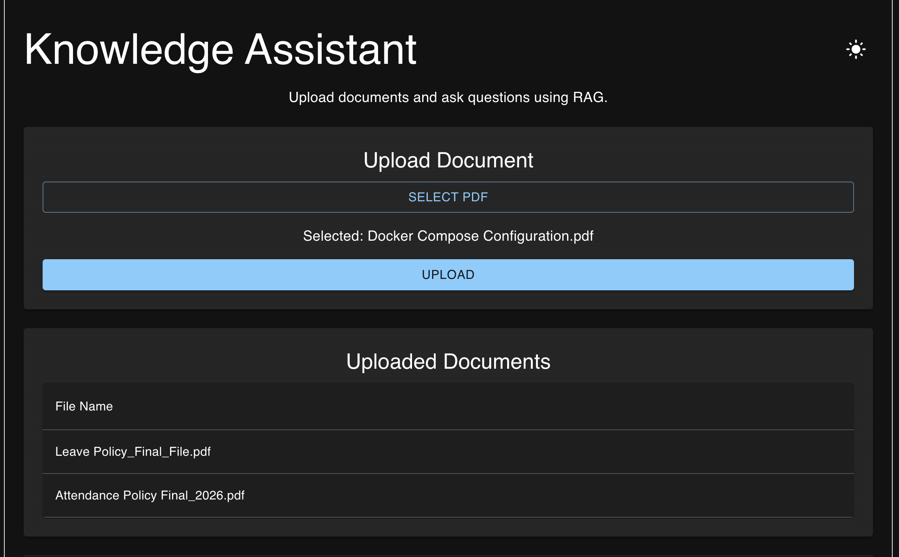

# AI Knowledge Assistant - Frontend

Frontend application for the AI Knowledge Assistant platform built using React and Material UI.

The application provides a ChatGPT-style interface for interacting with uploaded documents through a Retrieval Augmented Generation (RAG) backend powered by Spring Boot, Qdrant, PostgreSQL and Ollama.

## Backend Repository

Spring Boot Backend:

https://github.com/lavish-chhabra/knowledge-assistant

---

## Features

### Document Upload

* Upload PDF documents
* Backend integration using REST APIs
* Upload validation and error handling

### AI Chat Experience

* ChatGPT-style conversation interface
* Ask questions about uploaded documents
* Source citation support
* Conversation history

### User Experience

* Dark Mode support
* Responsive UI
* Auto-scroll to latest messages
* Loading indicators
* Error handling and notifications

---

## Screenshots

### Upload Document



### Chat Interface


---

## Tech Stack

### Frontend

* React
* Vite
* Material UI
* Axios
* JavaScript

### Backend Integration

* Spring Boot REST APIs
* Retrieval Augmented Generation (RAG)
* Ollama
* Qdrant
* PostgreSQL

---

## Architecture

```text
React UI
    |
    v
Axios HTTP Client
    |
    v
Spring Boot Backend
    |
    +----------------+
    |                |
    v                v

PostgreSQL      Qdrant
 Metadata      Vector Store
                    |
                    v
                 Ollama
```

---

## Available Features

### Upload Documents

Users can upload PDF documents which are processed by the backend and stored in the knowledge base.

### Ask Questions

Users can ask natural language questions against uploaded documents.

### Source Citations

Responses include source references showing which document contributed to the answer.

### Dark Mode

Switch between light and dark themes for improved user experience.

### Chat History

Maintain conversation history within the current session.

---

## Local Development

### Prerequisites

* Node.js 20+
* npm
* Backend Application Running

### Install Dependencies

```bash
npm install
```

### Start Development Server

```bash
npm run dev
```

Application URL:

```text
http://localhost:5173
```

---

## Backend Configuration

Default Backend URL:

```text
http://localhost:8080
```

Configured using Axios:

```javascript
const api = axios.create({
    baseURL: "http://localhost:8080"
});
```

---

## Screenshots

### Upload Documents

Add screenshot here:

```text
docs/screenshots/upload-screen.png
```

### Chat Interface

Add screenshot here:

```text
docs/screenshots/chat-screen.png
```

### Dark Mode

Add screenshot here:

```text
docs/screenshots/dark-mode.png
```

### Source Citations

Add screenshot here:

```text
docs/screenshots/source-citations.png
```

---

## Future Enhancements

* User Authentication
* Multi-user Support
* Streaming Responses
* Chat Sessions
* Document Management Dashboard
* Mobile Responsive Design
* Real-time Notifications

---

## Project Highlights

This project demonstrates:

* Modern React Development
* REST API Integration
* Material UI Design System
* State Management with React Hooks
* AI Application Frontend Development
* Full Stack Integration
* Production-Oriented Architecture

---

## Author

Lavish Chhabra

Java Backend Engineer | AI Engineering Enthusiast

Building AI-powered applications using Java, Spring Boot, React, LLMs, RAG, Cloud and Distributed Systems.
